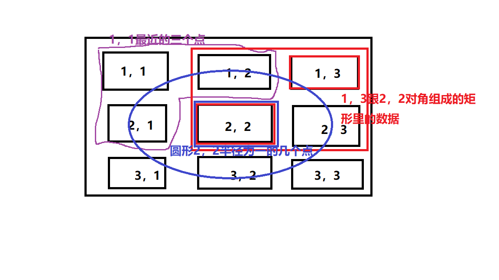

## robomongo mongo可视化工具

## 配置服务
```
删除服务
sc delete mongodb

添加服务
mongod.exe --dbpath E:\mdata --logpath E:\mlog --logappend --directoryperdb --serviceName "MongoDB" --install

--bind_ip	绑定服务IP，若绑定127.0.0.1，则只能本机访问，若绑定0.0.0.0，则默认可以通过ip来访问
--logpath	指定MongoDB日志文件，注意是指定文件不是目录
--logappend	使用追加的方式写日志
--dbpath	指定数据库路径
--port	指定服务端口号，默认端口27017
--serviceName	指定服务名称
--serviceDisplayName	指定服务名称，有多个mongodb服务时执行
--directoryperdb     每一数据库单独存放

--install	指定作为一个Windows服务安装
```

## 使用mongod 启动服务端
```
mongod --dbpath=./data
````

## 使用数据库
```
mongo 
// 启动客户端

show dbs 
// 查看所有的数据库

use school  
// 切换到school这个数据库，但是现在并不会创建。有没有这个数据库都可以切换过去

db.students.insert({name: 'zx',age: 24})
// db代表当前数据库  students代表新建集合 insert插入一条数据

db.students.remove({"_id": 1},{justOne: false})；
// 根据条件删除记录    justOne 默认false 删除全部匹配正确的， true 只删除一个

db || db.getName()
// 查看当前的数据库的名称

db.dropDatabase()
// 删除当前的数据库

db.collection.drop();
// 删除集合表

use school
db.createCollection('students')
// 切换到school 新建集合students

db.students.find()
// 查询students 下的数据

db.students.find().explain(true)
// 显示查询信息

db.students.count()
// 查询students 一共有多少数据

db.students.save({name: 'zx',age: 24})
// save = insert + update;有就更新没有就创建

show collections
// 查看有哪些集合
```

## update
```
db.collection.update(query,data,params)
// query     查询条件
// data      要替换的数据
params {
    multi: true,  // 默认false，只更新第一条更新到的数据，true是更新所有匹配到的数据
    upsert: true  // 默认false，更新时没有数据，就会创建一条新的数据
}

### 操作后的提示信息
{ 
    "nMatched" : 1,    // 匹配到多少条数据
    "nUpserted" : 0,   // 因为更新而插入的条数
    "nModified" : 1    // 更改的条数
}

### $set    添加字段
原始数据库信息
{ "_id" : 1, "name" : "zx", "age" : 24 }
{ "_id" : 2, "name" : "zx1", "age" : 24 }
{ "_id" : 3, "name" : "zx", "age" : 25 }

> db.students.update({name: 'zx1'},{age: 25})  // 不用操作符$set
// 更改后的数据
{ "_id" : 1, "name" : "zx", "age" : 24 }
{ "_id" : 2, "age" : 25 }
{ "_id" : 3, "name" : "zx", "age" : 25 }

> db.students.update({name: 'zx'},{$set: {age: 28}})  // 使用了$set 操作符
// 加上操作符$set 更改后的信息
{ "_id" : 1, "name" : "zx", "age" : 28 }
{ "_id" : 2, "age" : 25 }
{ "_id" : 3, "name" : "zx", "age" : 25 }

###  update中的最后一个参数
#####    multi
> db.students.update({name: 'zx'},{$set: {age: 29}},{multi: true}) // 添加multi时数据变化

{ "_id" : 1, "name" : "zx", "age" : 29 }
{ "_id" : 2, "age" : 25 }
{ "_id" : 3, "name" : "zx", "age" : 29 }

#####    upsert
> db.students.update({name: 'zx24'},{age: 29},{upsert: true}) // 添加multi时数据变化

{ "_id" : 1, "name" : "zx", "age" : 29 }
{ "_id" : 2, "age" : 25 }
{ "_id" : 3, "name" : "zx", "age" : 29 }
{ "_id" : ObjectId("5ceab9fdb2d9208fe124902b"), "age" : 29 }

> db.students.update({name: 'zx24'},{$set: {age: 29}},{upsert: true}) // 添加multi时数据变化

{ "_id" : 1, "name" : "zx", "age" : 29 }
{ "_id" : 2, "age" : 25 }
{ "_id" : 3, "name" : "zx", "age" : 29 }
{ "_id" : ObjectId("5ceab9fdb2d9208fe124902b"), "name" : "zx24", "age" : 29 }

### $inc    递增数量
> db.students.update({name: 'zx'},{$inc: {age: 4}})   // 给age递增4
// 给age加上
{ "_id" : 1, "name" : "zx", "age" : 32 }
{ "_id" : 2, "age" : 25 }
{ "_id" : 3, "name" : "zx", "age" : 25 }

### $unset    删除字段
> db.students.update({name: 'zx'},{$unset: {age: 25}})
// {$unset: {age: 25}} age的参数不会生效，只会更新匹配条件的第一条数据
{ "_id" : 1, "name" : "zx" }
{ "_id" : 2, "age" : 25 }
{ "_id" : 3, "name" : "zx", "age" : 25 }

### $push    数组追加
{ "_id" : ObjectId("5ceb4437b8d5eb6a3038de94"), "name" : "zx", "hobby" : [] }
> db.students.update({name: 'zx'},{$push: {hobby: '篮球'}})

{ "_id" : ObjectId("5ceb4437b8d5eb6a3038de94"), "name" : "zx", "hobby" : [ "篮球" ] }

### $ne    匹配条件
{ "_id" : ObjectId("5ceb4437b8d5eb6a3038de94"), "name" : "zx", "hobby" : [] }
> db.students.find({name: {$ne: 'zx'}})   // 因为加了$ne
//  数据里有一条name为zx的，但是输出结果为空

> db.students.update({name: 'zx',hobby: {$ne: '篮球'}},{$push: {hobby: '篮球'}}) 
// 因为hobby 加了$ne等于篮球，所以就不会在数组再添加一次
{ "_id" : ObjectId("5ceb4437b8d5eb6a3038de94"), "name" : "zx", "hobby" : [ "篮球" ] }

### $addToSet    set在se6中不允许重复
> db.students.update({name: 'zx'},{$addToSet: {hobby: '篮球'}})
// 匹配到一条，但是没有更新也没有更改
WriteResult({ "nMatched" : 1, "nUpserted" : 0, "nModified" : 0 })
// 执行了条件之后
{ "_id" : ObjectId("5ceb4e0fb8d5eb6a3038de95"), "name" : "zx", "hobby" : [ "篮球" ] }

### $each    将添加的数据遍历出来
加上了$each
> db.students.update({name: 'zx'},{$addToSet: {hobby: {$each: ['羽毛球','橄榄球']}}})

{ "_id" : ObjectId("5ceb4e0fb8d5eb6a3038de95"), "name" : "zx", "hobby" : [ "篮球", "羽毛球", "橄榄球" ] }

如果不加上 $each
db.students.update({name: 'zx'},{$addToSet: {hobby: ['羽毛球','橄榄球']}})
{ "_id" : ObjectId("5ceb4e0fb8d5eb6a3038de95"), "name" : "zx", "hobby" : [ "篮球", [ "羽毛球", "橄榄球" ] ] }

### 修改指定索引元素
db.students.update({name: 'zx'},{$set: {'hobby.2': '足球'}})  // hobby.2  是指数组的下标
```
### [runCommand()](./index.js '点击查看')


## 查询
```
db.collection.find(<query>,<return>)
db.collection.find(
    {name: 'zx'},   // 查询字段
    {name: 1}       // 返回的字段 1代表返回name字段 0不返回某一个字段
)

### findOne()
db.collection.findOne()    // 返回第一条数据

### $in
db.collection.find({age: {$in: [10,20]}})  // 年龄是10,20的

### $all
db.collection.find({arr: {$all: [10,20]}})  // 必须包含10和20的才会被查出来

### $size
db.collection.find({arr: {$size: 2}})  // 字段数组长度为二的被查出来

### $slice
db.collection.find({arr: {$size: 2}},{arr: {$slice: 1}})  // 查找出结果，并且截取数据

### $nin
db.collection.find({age: {$nin: [10,20]}})  // 只要年龄不是10和20的都返回

### $not    // nin一样，但是可以用在范围的时候
db.collection.find({age:{$not: {$gt: 20,$lt: 30}}})  // 除了小于20并且大于30的数据

### $where
db.collection.find({$where: "this.age > 20 && this.age < 40"})  // 万能查询

### $or 
db.collection.find({$or: [{name: 'zx'},{age: 20}]})  // name = 'zx' || age =20
db.collection.find({name: 'zx'},{$or: [{age: 20}, {age: 100}]}) // (name = 'zx') && (age = 20 || age = 100)

### skip(3) limit(3) sort({})
db.collection.find().skip(3).limit(3)  // skip跳过3条，limit取出三条数据
db.collection.find().sort({age: -1}).skip(3).limit(3)  // 倒叙排序 -1倒叙 1正序
```

## 导出数据库
> 1. mongoimport 导入数据库
> 2. mongoexport 导出数据库

> 1. mongorestore 导入数据
> 2. mongodump 导出数据

参数列表
```
-h      连接的数据库
-port   端口号
-u      用户名
-p      密码
-d      导出的数据库
-c      指定导出的集合
-o      导出文件存储路径
-q      进行过滤

####  使用
mongoexport -d school -c students -o stu.bak
// 导入时不需要-o
mongoimport -d school -c students stu.bak

// 指定数据库
mongodump -d school -o dumpData    // 导出数据库schoo到dumpData文件夹中
mongorestore -d school dumpData/school  

// 不指定数据库
mongodump -o dumpData  // 不指定路径 名称默认为dump
mongostore dumpData 
```

## 锁定解锁数据库
```
// 锁定
use admin
db.runCommand({fsync: 1,lock: 1})

// 解锁
db.fsyncUnlock();
```

## 安全
```
查看角色 
show roles;

内建的角色
数据库用户角色：read、readWrite;
数据库管理角色：dbAdmin、dbOwner、userAdmin；
集群管理角色：clusterAdmin、clusterManager、clusterMonitor、hostManager；
备份恢复角色：backup、restore；
所有数据库角色：readAnyDatabase、readWriteAnyDatabase、userAdminAnyDatabase、dbAdminAnyDatabase
超级用户角色：root 
内部角色：__system

角色说明：
Read：允许用户读取指定数据库
readWrite：允许用户读写指定数据库
dbAdmin：允许用户在指定数据库中执行管理函数，如索引创建、删除，查看统计或访问system.profile
userAdmin：允许用户向system.users集合写入，可以找指定数据库里创建、删除和管理用户
clusterAdmin：只在admin数据库中可用，赋予用户所有分片和复制集相关函数的管理权限。
readAnyDatabase：只在admin数据库中可用，赋予用户所有数据库的读权限
readWriteAnyDatabase：只在admin数据库中可用，赋予用户所有数据库的读写权限
userAdminAnyDatabase：只在admin数据库中可用，赋予用户所有数据库的userAdmin权限
dbAdminAnyDatabase：只在admin数据库中可用，赋予用户所有数据库的dbAdmin权限。
root：只在admin数据库中可用。超级账号，超级权限

添加用户
db.createUser({
    user: '',
    pwd: '',
    roles: [ // 这个用户在school这个数据库可以读写，在其他的数据库在可以读
        {   
            db: 'school',    
            role: 'readWrite'    
        },
        'read'
    ]
})

查看用户
show users

删除用户
db.dropUser('zx')
删除当前库下的所有用户
db.dropAllUser()

查看用户权限
db.runCommand({usersInfo: 'zx',showPrivileges: true})
```

## 高级查询

### [分组查询](./src/group.js)
```
查找不同值
db.runCommand({distinct: 'student',key: 'city'})
// distinct: collection的名字  key: 比较哪个字段

数据库的构建信息
db.runCommand({bulidInfo: 1})

得到最后一个错误信息
db.runCommand({getLastError: 'students'})

创建固定集合
db.createCollection('logs',{size: 5,max: 5,capped: true})
/logs 固定集合的名字   size 存储大小（k） max 最多可以存储几条  capped 封顶

判断是否固定集合
db.logs.isCapped()

非固定集合转为固定集合
db.runCommand({convertToCapped: 'logs',size: 5})
```

## gridfs
```
-d 数据库名称
-l 源文件位置
put 指定文件名

上传文件
mongofiles -d myfiles put text.txt

查看文件
在mongo命令下
use myfiles 
db.fs.files.find()

在正常命令下
mongofiles -d myfiles list

获取文件
mongofiles -d myfiles get text.txt

删除文件
mongofiles -d myfiles delete text.txt
```

## 索引
```
创建索引
db.collections.createIndex({age: 1})

创建指定名称索引
db.collections.createIndex({age: 1},{name: 'nameIndex'})

创建唯一索引
db.collections.createIndex({age: 1},{name: 'nameIndex',unique: true})

后台创建索引
db.collections.createIndex({age: 1},{name: 'nameIndex',background: true})

过期删除
db.collections.createIndex({time: 1},{name: 'nameIndex',expireAfterSeconds: 10})
// 索引关键字段必须是Date类型  非立即执行  单字段索引，混合索引不支持

全文检索
1. db.collections.insert({content: 'I am a boy'})
   db.collections.insert({content: 'I am a boy,girl'})
   db.collections.insert({content: 'I am a girl'})
2. db.collections.createIndex({constent: 'text'})
3. db.collections.find($text: {$search: 'boy'}})  
/*
    {$search: 'boy'} 查找有boy的
    {$search: 'boy -girl'} 有boy，不带girl的
    {$search: 'boy girl'} 或的关系
*/

查看
db.collections.getIndexes()

删除
db.collections.dropIndex('索引名称')

删除所有索引
db.collections.dropIndexes()
```

## 2d索引
```
创建数据
var gis = [
    {gis: {x: 1, y: 1}},
    {gis: {x: 1, y: 2}},
    {gis: {x: 1, y: 3}},
    {gis: {x: 2, y: 1}},
    {gis: {x: 2, y: 2}},
    {gis: {x: 2, y: 3}},
    {gis: {x: 3, y: 1}},
    {gis: {x: 3, y: 2}},
    {gis: {x: 3, y: 3}},
]
db.gis.insert(gis)

创建2b索引
db.gis.createIndex({gis: '2d'})

查询距离某点最近的3个点
db.gis.find({gis: {$near: [1,1]}}).limit(3)

矩形对角
db.gis.find({gis: {$within: {$box: [[1,3],[2,2]]}}})

圆形
db.gis.find({gis: {$within: {$center: [[2,2],1]}}})
```


## [主从（mongodb4.0.9现在已经不支持了）](./master-slave)

## [副本集](./rplica-set)
```
数据库conf
// 第一个数据
dbpath=./pepl1
port=1001
replSet=group
// 第二个数据
dbpath=./pepl1
port=1001
replSet=group

初始化
use admin
var conf = {
    _id: 'group',
    members: [
        {_id: 0, host: '127.0.0.1:1001'},
        {_id: 1, host: '127.0.0.1:1002'}
    ]
}
rs.initiate(conf)
rs.status()
```
